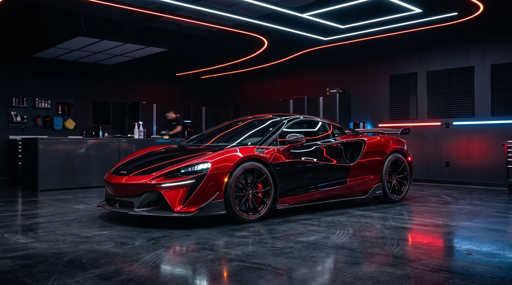

# A.G Estética e Pintura Automotiva

Website oficial da **A.G estética e pintura automotiva**, localizada no bairro Farroupilha em **Videira - SC**.

---

## 🏎️ Sobre o Projeto

Plataforma web desenvolvida com estética moderna *Dark Luxury* inspirada em conceitos esportivos e no design oficial da oficina.

### ✨ Funcionalidades Principais

- **Emblema Neon Personalizado:** Recriação vetorial e em alta resolução da logo em neon da oficina (silhueta de cupê esportivo com aerofólio em degradê vermelho/âmbar, capô branco e detalhes ciano/verde).
- **Atendimento Rápido via WhatsApp:** Conexão direta com a oficina para dúvidas e agendamentos.
- **Quadro de Horários Dinâmico:** Horários sincronizados com o perfil oficial do Google Maps, com detector inteligente em tempo real que indica se a oficina está aberta ou fechada no momento exato e destaca o dia atual.
- **Localização & Rotas no Google Maps:** Endereço completo no bairro Farroupilha, Videira - SC, botão de cópia com feedback visual (*toast*) e integração direta com rotas do Google Maps.
- **Animações de Scroll Fluídas:** Botões de rolagem suave com chevron animado, barra de progresso no topo e efeitos de entrada de conteúdo compatíveis com mobile e desktop.
- **Compromisso de Transparência:** Foco em dados reais e avaliação técnica presencial ou via fotos nítidas sem tabelas fictícias.

---

## 📍 Informações da Oficina

- **Nome:** A.G estética e pintura automotiva
- **Endereço:** Rua Antônio Marcon - Farroupilha, Videira - SC, 89560-544
- **Telefone / WhatsApp:** (49) 99935-9754
- **Horário de Atendimento:**
  - Segunda a Sexta: 09:00 às 17:00
  - Sábado: 09:00 às 17:00
  - Domingo: Fechado

---

## 🛠️ Tecnologias Utilizadas

- **HTML5 Semântico:** Estrutura acessível e otimizada para SEO.
- **CSS3 Moderno:** Design responsivo, variáveis CSS, gradientes, glassmorphism e animações baseadas em scroll.
- **JavaScript Vanilla:** Lógica em tempo real para horário de funcionamento, cópia de endereço e animações.
- **Google Fonts:** Tipografia com as fontes *Outfit* e *Inter*.
